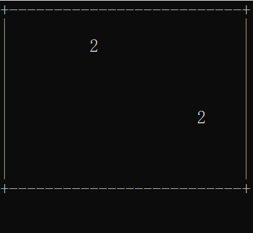
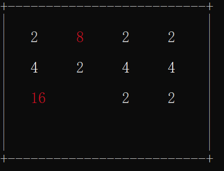

# VmOfLC3

本项目实现了用于教学的16位计算体系结构LC-3的进程虚拟机：

- 模拟了真实的LC-3体系结构机器的执行过程及其组件如cpu，内存，外部设备之间的交互，对于学习和理解计算机运行的底层原理有一定的帮助。

- 支持所有标准的LC-3指令，如LD，ST， LEA，JMP，BR...

- 目前仅支持Windows平台和Unix/Linux平台的输入输出处理。

- 目前不支持堆栈结构，程序状态寄存器(PSR)等体系结构的其他特性，如果您有兴趣，欢迎您来拓展此虚拟机的功能！

#### 如何构建？

- ##### ***构建注意事项：***

***1.构建此程序需要您的编译环境有基本c/c++编译工具链以及支持cmake和c++14。***

***2.由于我没在window平台上调试，所以如果您想在window上构建此虚拟机可能需要稍微修改一下  Cmakelist。***

- ##### ***构建步骤：***

```shell
git clone https://github.com/naruto-f/VmOfLC3.git
cd VmOfLC3
#脚本默认是编译Debug版本，如果您想让程序运行的更快可以使用: BUILD_TYPE=Release ./build.sh install
./build.sh install  
```

构建脚本执行完后在当前目录下会出现一个名为lc3vm的二进制可执行程序，同时目录下有一个编译好的LC-3的二进制程序2048，您需要这样执行2048游戏：

```shell
./lc3vm 2048.obj
```

如果虚拟机成功构建，您应该能看到如下图像并可以玩这个游戏：





#### 参考

- [LC-3标准指令集文档](https://www.jmeiners.com/lc3-vm/supplies/lc3-isa.pdf)
- [用不到 16 行的 C 语言编写一个简单的 125 位 VM |安德烈因 (andreinc.net)](https://www.andreinc.net/2021/12/01/writing-a-simple-vm-in-less-than-125-lines-of-c#the-main-memory)
- [Write your Own Virtual Machine (jmeiners.com)](https://www.jmeiners.com/lc3-vm/#s0:4)

